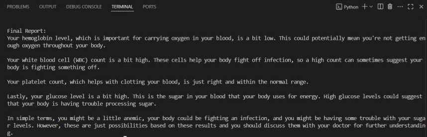

#python program

import os
from dotenv import load_dotenv
load_dotenv()
os.environ["OPENAI_API_KEY"] = os.getenv("OPENAI_API_KEY").strip()  #from env file
from crewai import Agent, Task, Crew
ocr_agent = Agent(
    role="OCR Parser",
    goal="Extract medical values from report text",
    backstory="A medical assistant that reads test results",
    allow_delegation=False
)
interpreter_agent = Agent(
    role="Health Data Interpreter",
    goal="Check test results against normal ranges",
    backstory="An expert in interpreting blood test reports",
    allow_delegation=False
)
summary_agent = Agent(
    role="Summary Generator",
    goal="Explain the test results in simple language",
    backstory="A helpful bot that makes reports understandable to patients",
    allow_delegation=False
)
report_text = """
Hemoglobin: 10.5 g/dL
WBC: 14,000 /µL
Platelets: 250,000 /µL
Glucose: 180 mg/dL
"""
task1 = Task(
    description=f"Extract values from this report: {report_text}",
    expected_output="List of test names and their values",
    agent=ocr_agent
)
task2 = Task(
    description="Based on the extracted values, identify if any are abnormal.",
    expected_output="List abnormal values and reasons",
    agent=interpreter_agent
)
task3 = Task(
    description="Summarize the results in easy-to-understand language for a patient.",
    expected_output="Patient-friendly explanation",
    agent=summary_agent
)
crew = Crew(
    agents=[ocr_agent, interpreter_agent, summary_agent],
    tasks=[task1, task2, task3],
    verbose=True
)
results = crew.kickoff()
print("\nFinal Report:")
print(results)

